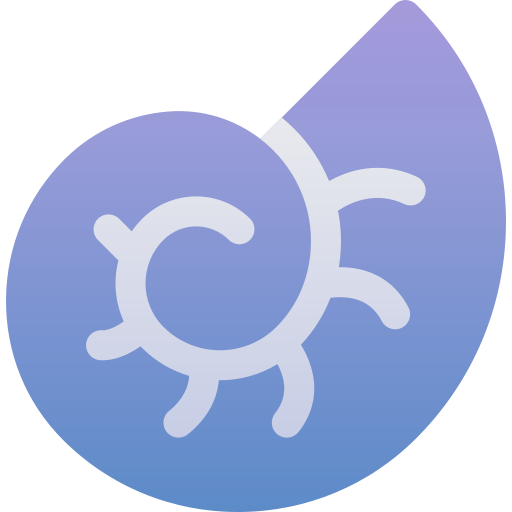

# PaleoDraw

<div align="center">



A desktop vector drawing tool built for paleontological illustration — think fossil reconstruction, skeletal diagrams, and scientific figures.

[](package.json)
[](https://www.electronjs.org/)
[](https://reactjs.org/)
[](LICENSE)

</div>

---

## Screenshots & Demo

<!-- Add your screenshots here -->
<!--  -->
<!--  -->
<!--  -->

<!-- Demo video — uncomment one of these once you have media ready: -->

<!-- Direct GitHub video (upload to an issue/PR, paste the URL here) -->
<!--
https://user-images.githubusercontent.com/YOUR_USER/YOUR_VIDEO.mp4
-->

<!-- YouTube embed -->
<!--
[](https://www.youtube.com/watch?v=YOUR_VIDEO_ID)
-->

<!-- GIF -->
<!--

-->

---

## What is PaleoDraw?

PaleoDraw is a capstone project I built to give paleontologists and scientific illustrators a free, dedicated drawing application. Most people in the field rely on general-purpose tools like Inkscape or Illustrator — this app is tailored specifically for the kind of work they do: reconstructing fossil outlines, tracing skeletal structures, and producing publication-ready vector diagrams.

It ships as a cross-platform desktop app (Windows, macOS, Linux) and stores projects as plain JSON, so your work is portable and version-control-friendly.

### Core features

- **Multiple spline types** — B-Spline for organic curves, NURBS for precise control, and straight-line segments
- **Point-level editing** — drag, snap (Ctrl+drag), and toggle sharp/smooth per control point
- **Multi-selection** — select and transform groups of splines or individual points at once
- **SVG import/export** — bring in reference SVGs or export your work for use in other apps
- **Template library** — preset fossil templates (T-Rex skull, Spinosaurus, Triceratops, etc.) to get started faster
- **Undo/redo** — full history stack so nothing is lost
- **Light & dark themes** — toggle with a single click
- **Keyboard-driven workflow** — hotkeys for every tool and major action

---

## Setup

### Prerequisites

- [Node.js](https://nodejs.org/) v18+
- [Git](https://git-scm.com/)

### Clone & install

```bash
git clone https://github.com/prohitman/PaleoDraw.git
cd PaleoDraw

# Root dependencies (Electron + build tools)
npm install

# Frontend dependencies (React + SVG.js)
cd frontend
npm install
cd ..
```

### Run in development mode

```bash
npm run dev
```

This starts the Vite dev server and launches Electron with hot-reload. The app window opens automatically.

### Build a distributable

```bash
npm run dist
```

Produces platform-specific installers in `dist/`:
- **Windows** → `.exe` (NSIS)
- **macOS** → `.dmg`
- **Linux** → `.AppImage`

---

## Keyboard Shortcuts

### Tools

| Key | Action |
|-----|--------|
| `T` | Select tool |
| `C` | Curve (B-Spline) |
| `L` | Straight line |
| `N` | NURBS |
| `I` | Import SVG |

### File

| Key | Action |
|-----|--------|
| `Ctrl+N` | New project |
| `Ctrl+O` | Open project |
| `Ctrl+S` | Save |
| `Ctrl+Shift+S` | Save as |
| `Ctrl+E` | Export SVG |

### Editing

| Key | Action |
|-----|--------|
| `Ctrl+Z / Ctrl+Y` | Undo / Redo |
| `Ctrl+C / V / X` | Copy / Paste / Cut |
| `Delete` | Delete selected |
| `R` | Reverse point direction |
| `Ctrl+F / Ctrl+Shift+F` | Forward / Front |
| `Ctrl+B / Ctrl+Shift+B` | Backward / Back |

### Navigation

| Key | Action |
|-----|--------|
| `Space+Drag` | Pan |
| `Scroll` | Zoom |
| `Escape` | Deselect / finish drawing |
| `Ctrl+Drag` | Snap point |

---

## Project Structure

```
PaleoDraw/
├── electron/               # Main process + preload (IPC bridge)
├── frontend/
│   ├── public/             # Static assets, help docs, templates
│   └── src/
│       ├── components/     # React UI (Canvas, Toolbar, Dialogs)
│       ├── core/           # EventBus (pub/sub communication)
│       ├── handlers/       # Tool & interaction handlers
│       ├── managers/       # Business logic (Spline, History, Project, Selection)
│       ├── models/         # Data models (Spline)
│       ├── services/       # File I/O and project persistence
│       ├── input/          # Hotkey management
│       ├── plugins/        # Auto-history plugin
│       └── styles/         # CSS themes + MUI config
├── package.json            # Electron build config
└── README.md
```

---

## Tech Stack

| Layer | Tech |
|-------|------|
| Desktop shell | Electron 38 |
| UI framework | React 19 + Material UI 7 |
| Vector engine | SVG.js 3 (with select, resize, draggable, panzoom plugins) |
| Bundler | Vite 7 |
| Styling | CSS custom properties + Tailwind + MUI theming |
| Architecture | Manager pattern + EventBus (pub/sub), plugin-extensible |

---

## License

[ISC](LICENSE)

